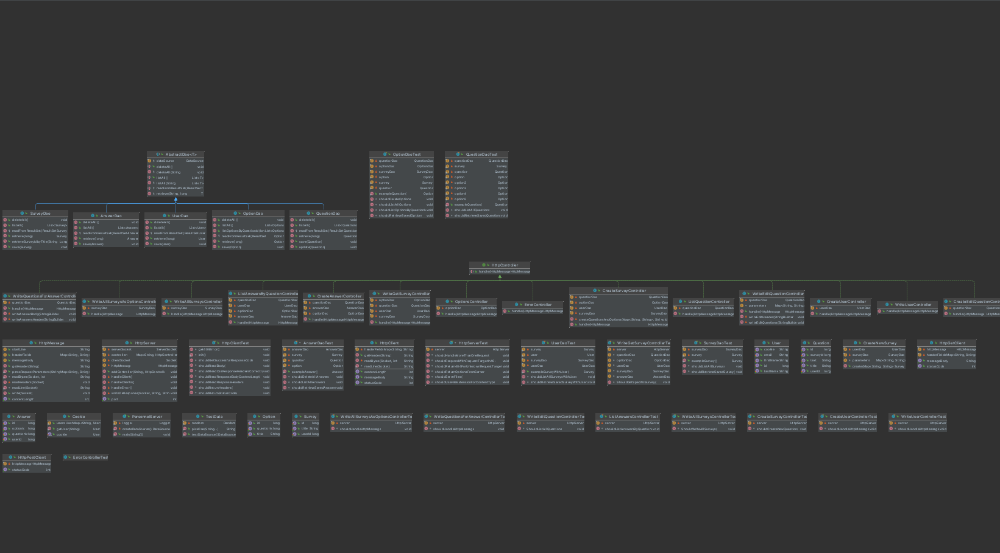

# PGR203 Avansert Java eksamen


### Made by
@Dankni95 (Daniel Lysak)

@jannickeham (Jannicke Hamarsnes)

## Beskriv hvordan programmet skal testes:
Opprett pgr203.properties i root med følgende:
````
dataSource.url=jdbc:postgresql://localhost:5432/survey_db
dataSource.username=survey_dbuser
dataSource.password=yourpasswordhere
````

I terminal:

mvn package

java -jar target/http-server-1.0-SNAPSHOT.jar


### Funksjonalitet
- Opprette bruker med fornavn, etternavn og epost. Dersom bruker ikke opprettes vil det brukes en default-bruker til opprettelse av spørreundersøkelser og besvarelser.
- Bruker kan opprette egen spørreundersøkelse med spørsmål eller legge til spørsmål i allerede eksisterende spørreundersøkelse.
- Brukeren kan legge til opptil flere svaralternativer per spørsmål. Hvert alternativ vil vises som en radio-button.
- Bruker kan besvare spørreundersøkelser blant alle som er opprettet.
- Bruker kan se besvarelser knyttet til hver enkelt spørsmål.
  - Lister ut tittel på spørsmål, spørsmålet, besvarelse, og av hvilken bruker.
- Bruker kan redigere et spørsmåls tittel og tekst.

### Ekstra
- Cookies for å bevare nylig registrert bruker.
- Encoding av tekst.
- Sende brukeren tilbake til der de var ved POST.
- GET og POST har samme request target.
- Bruk av felles kode i AbstractDao.
- Statuskode 500 ved krasj av server.
- Rettet feil i JDBC-kode fra forelesning.
- Håndtering av request target "/"
- UML diagram som dokumenterer datamodell og/eller arkitektur (presentert i README.md)
- Avansert datamodell (mer enn 3 tabeller)

### Databasemodell


### Diagram


## Sjekkliste

## Vedlegg: Sjekkliste for innlevering

* [x] Dere har lest eksamensteksten
* [x] Dere har lastet opp en ZIP-fil med navn basert på navnet på deres Github repository
* [x] Koden er sjekket inn på github.com/pgr203-2021-repository
* [x] Dere har committed kode med begge prosjektdeltagernes GitHub konto (alternativt: README beskriver arbeidsform)

### README.md

* [x] `README.md` inneholder en korrekt link til Github Actions
* [x] `README.md` beskriver prosjektets funksjonalitet, hvordan man bygger det og hvordan man kjører det
* [x] `README.md` beskriver eventuell ekstra leveranse utover minimum
* [x] `README.md` inneholder et diagram som viser datamodellen

### Koden

* [x] `mvn package` bygger en executable jar-fil
* [x] Koden inneholder et godt sett med tester
* [x] `java -jar target/...jar` (etter `mvn package`) lar bruker legge til og liste ut data fra databasen via webgrensesnitt
* [ ] Serveren leser HTML-filer fra JAR-filen slik at den ikke er avhengig av å kjøre i samme directory som kildekoden
* [x] Programmet leser `dataSource.url`, `dataSource.username` og `dataSource.password` fra `pgr203.properties` for å connecte til databasen
* [x] Programmet bruker Flywaydb for å sette opp databaseskjema
* [x] Server skriver nyttige loggmeldinger, inkludert informasjon om hvilken URL den kjører på ved oppstart

### Funksjonalitet

* [x] Programmet kan opprette spørsmål og lagrer disse i databasen (påkrevd for bestått)
* [x] Programmet kan vise spørsmål (påkrevd for D)
* [x] Programmet kan legge til alternativ for spørsmål (påkrevd for D)
* [x] Programmet kan registrere svar på spørsmål (påkrevd for C)
* [x] Programmet kan endre tittel og tekst på et spørsmål (påkrevd for B)

### Ekstraspørsmål (dere må løse mange/noen av disse for å oppnå A/B)

* [x] Før en bruker svarer på et spørsmål hadde det vært fint å la brukeren registrere navnet sitt. Klarer dere å implementere dette med cookies? Lag en form med en POST request der serveren sender tilbake Set-Cookie headeren. Browseren vil sende en Cookie header tilbake i alle requester. Bruk denne til å legge inn navnet på brukerens svar
* [x] Når brukeren utfører en POST hadde det vært fint å sende brukeren tilbake til dit de var før. Det krever at man svarer med response code 303 See other og headeren Location
* [x] Når brukeren skriver inn en tekst på norsk må man passe på å få encoding riktig. Klarer dere å lage en <form> med action=POST og encoding=UTF-8 som fungerer med norske tegn? Klarer dere å få æøå til å fungere i tester som gjør både POST og GET?
* [x] Å opprette og liste spørsmål hadde vært logisk og REST-fult å gjøre med GET /api/questions og POST /api/questions. Klarer dere å endre måten dere hånderer controllers på slik at en GET og en POST request kan ha samme request target?
* [x] Vi har sett på hvordan å bruke AbstractDao for å få felles kode for retrieve og list. Kan dere bruke felles kode i AbstractDao for å unngå duplisering av inserts og updates?
* [x] Dersom noe alvorlig galt skjer vil serveren krasje. Serveren burde i stedet logge dette og returnere en status code 500 til brukeren
* [x] Dersom brukeren går til http://localhost:8080 får man 404. Serveren burde i stedet returnere innholdet av index.html
* [ ] Et favorittikon er et lite ikon som nettleseren viser i tab-vinduer for en webapplikasjon. Kan dere lage et favorittikon for deres server? Tips: ikonet er en binærfil og ikke en tekst og det går derfor ikke an å laste den inn i en StringBuilder
* [ ] I forelesningen har vi sett på å innføre begrepet Controllers for å organisere logikken i serveren. Unntaket fra det som håndteres med controllers er håndtering av filer på disk. Kan dere skrive om HttpServer til å bruke en FileController for å lese filer fra disk?
* [x] Kan dere lage noen diagrammer som illustrerer hvordan programmet deres virker?
* [x] JDBC koden fra forelesningen har en feil ved retrieve dersom id ikke finnes. Kan dere rette denne?
* [x] I forelesningen fikk vi en rar feil med CSS når vi hadde `<!DOCTYPE html>`. Grunnen til det er feil content-type. Klarer dere å fikse det slik at det fungerer å ha `<!DOCTYPE html>` på starten av alle HTML-filer?
* [ ] Klarer dere å lage en Coverage-rapport med GitHub Actions med Coveralls? (Advarsel: Foreleser har nylig opplevd feil med Coveralls så det er ikke sikkert dere får det til å virke)
* [ ] FARLIG: I løpet av kurset har HttpServer og tester fått funksjonalitet som ikke lenger er nødvendig. Klarer dere å fjerne alt som er overflødig nå uten å også fjerne kode som fortsatt har verdi? (Advarsel: Denne kan trekke ned dersom dere gjør det feil!)

### Erfaringer fra arbeidet

